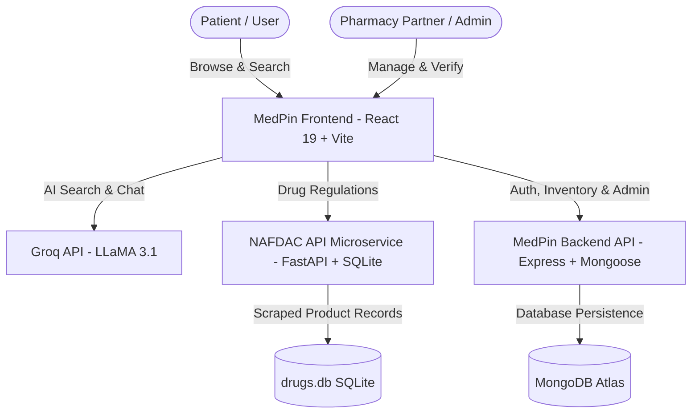

# MedPin

<p align="center">
  
</p>

<p align="center">
  <strong>Intelligent Pharmacy Discovery & Medication Verification Platform for Nigeria</strong>
</p>

<p align="center">
  <a href="https://github.com/Onwuka2007/medpin/blob/main/LICENSE"></a>
  
  
  
  
  
  
  
</p>

---

## Overview

**MedPin** is a healthcare technology platform designed to solve drug discovery, availability, and authenticity challenges across Nigeria. 

Patients often face stockouts, price disparities, and counterfeit concerns when searching for medications. MedPin bridges this gap by connecting patients directly with verified community pharmacies, providing AI-powered natural language drug search, live stock availability, transparent pricing in Nigerian Naira (₦), and regulatory validation through the **NAFDAC Greenbook**.

---

## Key Features

### AI-Powered Medication Search
- Natural language query understanding powered by **Groq (LLaMA 3.1 8B Instant)**.
- Intelligently parses brand names, generic formulations, dosage forms, active ingredients, and common phonetic misspellings.
- Categorized drug insights with usage guidance and precautions.

### Interactive Pharmacy Locator
- Live interactive map rendered with **Leaflet** and **OpenStreetMap**.
- Real-time geolocation support with **Haversine distance calculation** to display nearest pharmacies first.
- Detailed pharmacy cards showing operational hours, address, contact details, delivery options, and turn-by-turn navigation links.

### Real-Time Inventory & Price Transparency
- Browse drug availability status across participating pharmacies.
- Compare unit pricing (NGN) and estimated fulfillment/delivery times.
- Verified badges for vetted and licensed pharmaceutical partners.

### NAFDAC Greenbook Regulatory Verification
- Integrated microservice crawling official [NAFDAC Greenbook](http://greenbook.nafdac.gov.ng) records.
- Instant search and verification of over **12,000+** registered drug products, NAFDAC Registration Numbers (NRN), active ingredients, and manufacturer credentials.

### Pharmacy Partner Portal & Verification Workflow
- Multi-step pharmacy registration flow with business documentation and license capture.
- Admin review pipeline with approval and structured rejection feedback.
- Dedicated pharmacy management dashboard with inventory, stock status toggles, and performance statistics.

### AI Medical Assistant
- Floating contextual medical assistant sheet for drug inquiry, symptoms clarification, and nearby stock recommendations.

---

## Architecture



---

## Tech Stack

| Domain | Technologies |
|---|---|
| **Frontend** | React 19, React Router v7, Vite 8, Radix UI primitives, Lucide React, Recharts |
| **Styling** | Tailwind CSS v4, Class Variance Authority (CVA), Tailwind Merge |
| **Backend API** | Node.js, Express 5, Mongoose 9, Helmet, CORS, Express Rate Limit |
| **Authentication & Security** | JSON Web Tokens (JWT), Bcrypt.js, Joi schema validation |
| **NAFDAC Microservice** | Python 3.10+, FastAPI, Uvicorn, SQLite3, BeautifulSoup4, HTTPX |
| **AI / Machine Learning** | Groq SDK (`llama-3.1-8b-instant`) |
| **Maps & Geospatial** | Leaflet, React Leaflet, OpenStreetMap, Haversine formula |
| **Database** | MongoDB Atlas (core application), SQLite (NAFDAC registry database) |

---

## 📂 Project Structure

```
medpin/
├── public/                 # Static branding assets and icons
├── src/                    # Frontend React application
│   ├── assets/             # Media and medication images
│   ├── components/         # Reusable UI & feature components
│   │   ├── assistant/      # AI medical assistant floating sheet
│   │   ├── admin-dashboard/# Admin approval & verification UI
│   │   ├── hero/           # Hero search and navigation
│   │   ├── map/            # Interactive Leaflet pharmacy map
│   │   ├── pharmacy-dashboard/ # Partner portal tabs & inventory modals
│   │   ├── search/         # Drug & pharmacy search result cards
│   │   └── ui/             # Radix & Tailwind design system components
│   ├── data/mock/          # Mock fixtures for rapid prototyping
│   ├── lib/                # API client, auth utilities, distance calculators
│   ├── pages/              # Route views (Home, Search, Dashboards, Auth)
│   └── services/           # Groq AI, search engine, OpenFDA integrations
├── backend/                # Express.js REST API
│   ├── src/
│   │   ├── controllers/    # Pharmacy auth, list, verify, reject logic
│   │   ├── db/             # Mongoose connection setup
│   │   ├── middlewares/    # JWT auth, role authorization, rate limiter
│   │   ├── models/         # Pharmacy Mongoose schema
│   │   ├── routes/         # Express API routes
│   │   └── validators/     # Joi validation schemas
│   └── package.json
├── nafdac-api/             # Python FastAPI NAFDAC Greenbook scraper & API
│   ├── api.py              # FastAPI application endpoints
│   ├── scraper.py          # Asynchronous Greenbook crawler
│   ├── drugs.db            # SQLite database with scraped drug catalog
│   ├── requirements.txt    # Python dependencies
│   └── railway.toml        # Railway deployment config
├── .env.example            # Root environment variable template
├── package.json            # Frontend package scripts and dependencies
└── vite.config.js          # Vite configuration
```

---

## 🚀 Getting Started

### Prerequisites

Ensure you have the following installed on your development machine:
- **Node.js**: v18.0.0 or higher
- **npm**: v9.0.0 or higher
- **Python**: 3.10+ (if running the NAFDAC scraper/API locally)
- **MongoDB**: A free [MongoDB Atlas](https://www.mongodb.com/cloud/atlas) cluster or local MongoDB instance
- **Groq API Key**: Obtain a free key from the [Groq Console](https://console.groq.com)

---

### 1. Clone the Repository

```bash
git clone --recurse-submodules https://github.com/Onwuka2007/medpin.git
cd medpin
```

---

### 2. Configure Environment Variables

Create the required environment files from their respective `.env.example` templates:

#### Root (Frontend)
```bash
cp .env.example .env
```
Edit `.env`:
```ini
VITE_GROQ_API_KEY=your_groq_api_key_here
VITE_NAFDAC_API_URL=https://nafdac-api-production.up.railway.app
VITE_API_BASE_URL=http://localhost:8080
```

#### Backend API
```bash
cp backend/.env.example backend/.env
```
Edit `backend/.env`:
```ini
PORT=8080
MONGO_URI=mongodb+srv://<username>:<password>@cluster.mongodb.net/medpin
JWT_SECRET=your_super_secret_jwt_key
JWT_EXPIRES_IN=7d
```

#### NAFDAC API (Optional if running locally)
```bash
cp nafdac-api/.env.example nafdac-api/.env
```

---

### 3. Run the Applications

#### Option A: Run Frontend (Client)
```bash
npm install
npm run dev
```
The client will be running at **http://localhost:5173**.

#### Option B: Run Express Backend
```bash
cd backend
npm install
npm run dev
```
The backend server will start at **http://localhost:8080**.

#### Option C: Run NAFDAC Greenbook API (Local)
```bash
cd nafdac-api
python -m venv .venv

# On Windows:
.venv\Scripts\activate
# On macOS/Linux:
source .venv/bin/activate

pip install -r requirements.txt
uvicorn api:app --reload --port 8000
```
Interactive API docs will be available at **http://localhost:8000/docs**.

---

## 📡 API Overview

### Backend Endpoints (`/pharmacy`)

| Method | Endpoint | Description | Auth Required |
|---|---|---|---|
| `POST` | `/pharmacy/register` | Register a new pharmacy account | No |
| `POST` | `/pharmacy/login` | Authenticate pharmacy and receive JWT | No (Rate Limited) |
| `GET` | `/pharmacy/list` | List pharmacies with optional status filter | Yes (Admin) |
| `GET` | `/pharmacy/:id` | Get pharmacy profile by ID | Yes |
| `PATCH` | `/pharmacy/:id/verify` | Approve a pending pharmacy application | Yes (Admin) |
| `PATCH` | `/pharmacy/:id/reject` | Reject application with reason | Yes (Admin) |

### NAFDAC Greenbook Endpoints

| Method | Endpoint | Description |
|---|---|---|
| `GET` | `/drugs` | List and paginate registered drug products with filters |
| `GET` | `/drugs/{nrn}` | Retrieve drug details by NAFDAC Registration Number |
| `GET` | `/drugs/search?q={query}` | Search by product name, active ingredient, or applicant |
| `GET` | `/ingredients` | List all unique active pharmaceutical ingredients |
| `GET` | `/manufacturers` | List drug manufacturers and product counts |
| `GET` | `/stats` | Aggregate catalog metrics and product statistics |

---

## 🔒 Security & Privacy

- **Environment Hygiene**: All sensitive credentials, database connection strings, and API keys are strictly excluded via `.gitignore`.
- **Authentication**: Passwords are encrypted using salted `bcryptjs` hashing. API routes use signed `jsonwebtoken` tokens.
- **Request Hardening**: `helmet` headers, CORS whitelisting, and strict request validation with `joi` schemas.
- **Rate Limiting**: Critical endpoints (such as login) are shielded with `express-rate-limit` against brute-force attacks.

> [!WARNING]
> Never commit `.env` files or secret keys into version control. Ensure all deployments supply secrets via environment variables or secret managers.

---

## 📸 Screenshots

<p align="center">
  
  
</p>

---

## 🗺️ Roadmap

- [x] Natural language medication search with Groq LLaMA 3.1
- [x] Interactive pharmacy map locator with distance calculations
- [x] NAFDAC Greenbook database scraper and microservice
- [x] Pharmacy partner onboarding & admin verification pipeline
- [ ] Real-time inventory synchronization with pharmacy POS systems
- [ ] Patient accounts with prescription upload history
- [ ] SMS and WhatsApp notifications for medication stock alerts
- [ ] Nationwide coverage expansion beyond Lagos and Abuja

---

## 📄 License

This project is licensed under the [MIT License](LICENSE).
